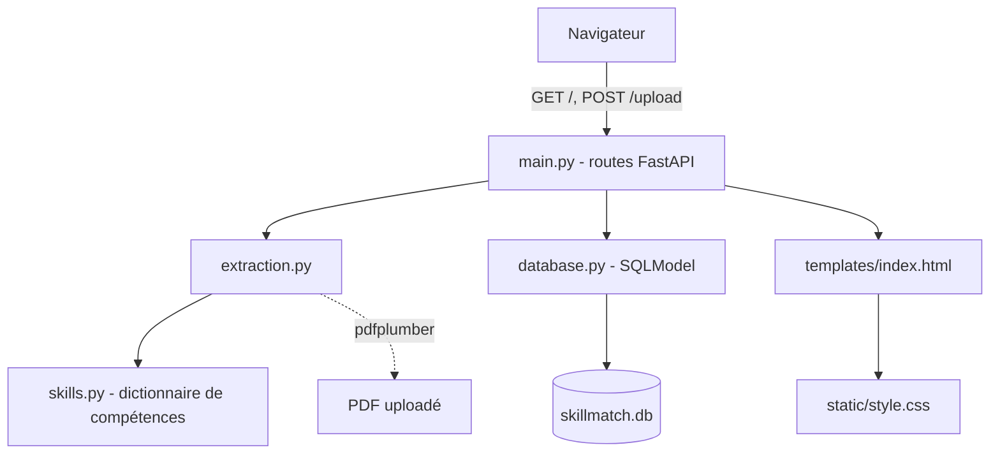

# Architecture

## Schéma

## Pourquoi cette séparation

- **`skills.py`** ne contient qu'une donnée (le dictionnaire de compétences), rien d'autre. Facile à faire évoluer sans toucher au reste.
- **`extraction.py`** s'occupe de lire le PDF et de détecter les compétences dedans. Il ne connaît ni la base de données ni FastAPI : on peut le tester tout seul (`tests/test_extraction.py`), sans lancer de serveur.
- **`database.py`** s'occupe uniquement de SQLite (modèles + requêtes). Même logique : testable indépendamment (`tests/test_database.py`).
- **`main.py`** fait juste le lien entre les deux : il reçoit la requête HTTP, appelle `extraction.py` puis `database.py`, et renvoie soit du JSON, soit une page HTML.

Ça évite de tout mettre dans un seul fichier fourre-tout, et ça permet de tester la logique métier (extraction, détection, base) sans dépendre du serveur web.

## Prototype fonctionnel

L'application tourne avec `uvicorn app.main:app --reload` (voir `docs/manuel.md`). La page d'accueil contient :
- un formulaire d'upload de CV (PDF),
- un champ de recherche par compétence,
- un tableau listant les candidats et leurs compétences détectées.
